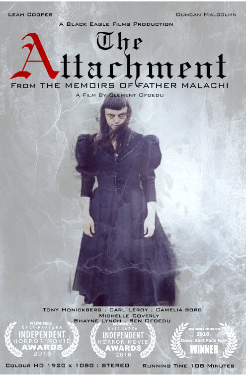

## repo = tam-ms1-c
# **The Attachment-Movie**
## The code-institute (**Milestone-1** project)

## Clement Ofoedu

["**The Attachment**"](https://cofoeducistudent.github.io/tam-ms1-c/)

 

 
 
## **PROJECT MANDATE**

An independent film company **Black Eagle films(BEF)** are in the process of releasing a horror flick on halloween 2019 called **“The Attachment”**. They need a website developer to create a basic static web site that will aid them in promoting the film.  

## **EXTERNAL USER GOAL**
Black Eagle films anticipate the site users or customers are movie-goers and some are horror film fans who appreciate a low-budget horror.Been in business for some time BEF have an idea about their market.

* Typically, users wish to find out about upcoming films, see images from the movie, and of course a trailer  to whet their appetite.

* In addition, they like to see or find out something about the production.

* If interested,  users normally like the option to contact the film promoters if they have any questions, such as what the certification rating is expected to be when the film is released and where it will be shown.

## **SITE OWNER GOAL**
From Black Eagle Film’s perspective, they wish the site to be a first step in their film promotion stratergy, providing the above typically expected information to their customers.

They wish the site to reflect the nature of the film and **not pander to 'gore-slasher' type material**.

They wish to capture some basic details of their potential customers, by giving them the option to provide email, names, and any other comments.

They wish this information to be used in future promotion or marketing endeavours.

Therefore, Black Eagle Films have asked for the site to:
1.	Have a nice clean fresh and simple look with a colour scheme that fits the material. They will supply images.
2.	They wish to show picture stills and/or  promotional material for the film to entice the audience.
3.	They also wish to show a movie trailer to help entice the audience, wheting their appetite.
4.	Finally  they wish to collect basic contact details from users for future promotional and marketing endeavours.

## Advanced potential features
Black Eagle Films have indicated that in the future, there is a chance that they would wish the website to be capable of sending messages back to their fans utilising the contact details gathered. **However, they have agreed that this feature will fall under a different release**.
