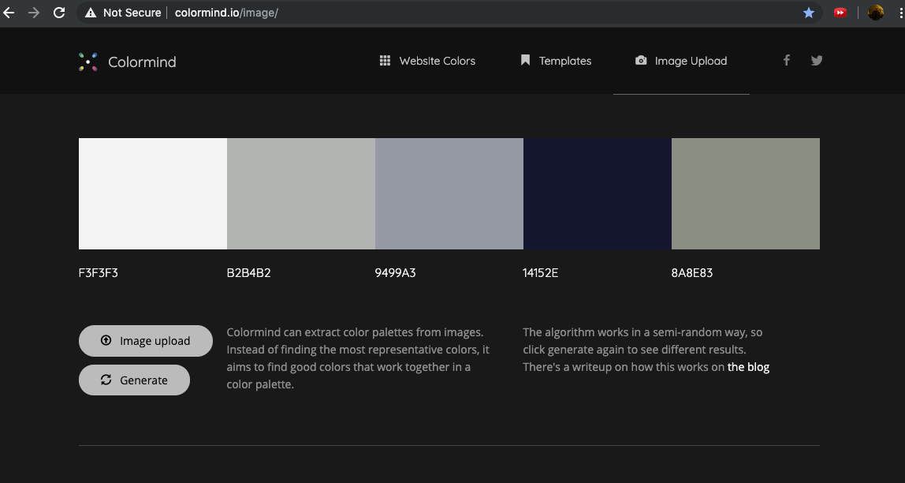

## repo = tam-ms1-c
# **The Attachment-Movie**
## The code-institute (**Milestone-1** project)

## Coder: **Clement Ofoedu**

 ---

 # **Index**

[**1. UX**](#ux )

[_a.Stratergy_](#stratergy)

[_b.Scope_](#scope)

[_c.Structure_](#structure)

[_d.Skeleton_](#skeleton)

[_e.Surface_](#surface)

---
[**2. Features**](#features)

[**3. Existing Features**](#existing-features)

[**3. Features Left to Implement**](#features-left-to-implement)

[**4. Technologies Used**](#technologies-used)

[**5. Testing**](#testing)

[**6. Deployment**](#deployment)

[**7. Credits**](#credits)

---

[**8. Content**](#content)

[**9. Media**](#media)

[**10. Acknowledgements**](#acknowledgements)

 ---

# **UX**
---
---

###  **PROJECT MANDATE**

["**The Attachment**"](https://cofoeducistudent.github.io/tam-ms1-c/)

An independent film production company **Black Eagle films(BEF)** are in the process of releasing a horror flick on halloween 2019 called **“The Attachment”**. They need a website developer to create a basic static web site that will aid them in promoting the film.  

## **(S)tratergy**

#### **EXTERNAL USER GOAL**
Black Eagle films anticipate the site users or customers are movie-goers and some are horror film fans who appreciate a low-budget horror.Been in business for some time BEF have an idea about their market.

* Typically, users wish to find out about upcoming films, see images from the movie, and of course a trailer  to whet their appetite.

* In addition, they like to see or find out something about the production.

* If interested,  users like the option to contact the promoters if they have any questions, such as what the certification rating is expected to be when the film is released and where it will be shown.

#### **SITE OWNER GOAL**
From Black Eagle Film’s perspective, they wish the site to be a first step in their promotion stratergy for the film , providing typically expected information to their customers.

They wish the site to reflect the nature of the film and **not pander to 'gore-slasher' type materials**.

They wish to capture some basic details of their potential customers, by giving them the option to provide email, names, and any other comments.

They wish this information to be used in future promotion or marketing endeavours.

Therefore, Black Eagle Films have asked for the site to:
1.	Have a nice clean fresh and simple look with a colour scheme that fits the material. They will supply images.
2.	They wish to show picture stills and/or  promotional material for the film to entice the audience.
3.	They also wish to show a movie trailer to help entice the audience, wheting their appetite.
4.  Provide an ability to offer the user more off-line information (Like a press-kit)
5.	Finally  they wish to collect basic contact details from users for future promotional and marketing endeavours.

#### Advanced potential features
**Black Eagle Films have indicated that in the future, there is a chance that they would wish the website to be capable of sending messages back to their fans utilising the contact details gathered. However, they have agreed that this feature will fall under a different release**.

---

#### **Project purpose**
**The purpose of this project then, is to create an initial web  prescence in the form of a basic static website for the soon to be released feature film 'THE ATTACHMENT' from Black Eagle Films.**

**Black Eagle Films will be the owner of the site after deployment, and I will be refer to them in this document as BEF for simplicity.**.

BEF have said that they require five things from the initial site release.
* One is an aesthetic.
* The other four are features.
* BEF also anticipate **( but not green-lit )** another feature for the future.

#### Requirements Table

| Requirement No| Item | Classification |
| -------------- |:----------------------:|:-------------|
|1|Clean simple look & a suitable color scheme|Asthetic|
|2|Have Pictures & Promo info |Feature|
|3|Production/Behind The scenes|Feature|
|4|Movie Trailer|Feature|
|5|Download Section|Feature|
|6|Collect user data / Contact Section|Feature|
|7|Post communication to users|Out-of-scope

#### Feature **(7)** as Out of scope **OOS**, this is **not green-lit** and I suspect will be a mixture of back-end and front-end when delivered. Indeed, if a front end section is required it will be likley implemented using admin login credential to stop spam mailing. There is also the chance that BEF may decide to utilize a different system to do this as many ofther companies do. BEF also spoke about promo material. When further quizzed as to the nature of promo-material, BEF eloborated that they will provide a **'Press-kit pdf'** file for download, as this is typicaly used by press and festivals etc. They will also provide the images and stills for the site. This pdf will be covered under the **download feature**.
---
#### Approach

The appoach I have decided to use in completing the project and site design is the **five stage User design principle**.

* Stratergy
* Scope
* Structure
* Skeleton
* Surface

Following further discussions to flesh out the requirements and scope, Black Eagle films said this website will be the best way of engaging their audience initially, as most of their target audiience have access to computers or mobile devices and are comfortable watching media content in its various forms.

**In addition using the internet and web-technologies will allow them to capitalise on a broader geographic regions with significantly reduced capital expenditure**.

This is important because as an independent film producing company, they have limited funding.

The **features that have been decided on** between Me(Webdesigner) & BEF are as follows:
1.	Navigation bar
2.	About section
3.	Trailer section
4.	Behind-the-scenes section
5.	Contact form
6. Download Presss-Kit Feature 
to validate the necessity for these features I have provided user stories to support them.

Following clarification of BEF's requirements for their website I have dicided on the following approach. 

* **The website will be a simple single page scroller with multiple sections.
It will have a navigation bar at the top. The Navigation bar will allow the user to navigate to different sections further down the page**.

* I have put to BEF, that  many people have **smart phones capable of web access**, which is only increasing in volume yearly. The first point of contact with the film protion material, should be the phone as it is ubiquitous.
Also, people are more comfortable with hand guesture scrolling on a small touch screen phone while on the move than trying to read the navigation bar. It's more natural. Also, user they will not be on the site for typing in large bits of data, rather absorbing the info shown.

* The section for supplying contact details should be limited and brief ( Atleast at first contact).

* I also highlighted the fact that the film medium on release may actually be ulimately consumed on a smartphone. For many people this is a norm, especially if the film is placed on a streaming service such as **Netflix** or **Amazon Prime**.

* I shall also implement a navigation bar, because although we will be employing **mobile first design principles**. We do envisage some members of the audience having access to desktop-computers and televison also. The latter usually does not offer touch screen capabilities in any significant volume.

* I have also decided to go with a plain light background in contrast to my initial thoughts. This will allow for the clean fresh look. BEF have been clear that the film is not to be confused with standard horror gore, therefore I will avoid any references to blood and guts imagery.

* BEF has said in conversation, the film is a spooky drama, rather than a horror and they also wish it to appeal to a wider audience demographics.

* My initial thoughts were to have the site on a predominat dark/black background, but this would lean towards the type of film that BEF wish to differentiate theselves from.

* Indeed from my conversations I gathered BEF wish to capture as much of an audience as possible, for which they avoided filming any scenes taht would push up their certification rating.

**BEF wish the film to be promoted as a spooky tea-time mystery, and has said the film does not contain nudity or strong foul language. They also say it has has an intended positive message with a christian slant, and they wish it to be certified as a PG.**

This has clarified and convinced me that I should avoid anything contentious, and pursue a direction that won't upset people by misrepresenting this fact.

#### **The sections on the single scroll page will be as follows:**
* **About** - To quickly inform the user in breif about the film.
* **Trailer** - Show a trailer from the film
I have placed this second in order , as people usually wish to get to the meat and potatoes quickly.
* **Production** -A small bit about the production of the film
* **Contact** - A section providing a means for the users to contact BEF & allow BEF to collect the email addresses
* **Download** - Press Kit Section , allowing anyone intrested to get access to more indepth material.

To Validtae the need for the features, I carried out a user story process. The results are from **self input** (as a user) and  **BEF requirements**.

#### User Stories

**User** = A Typical end user
**Owner** = BEF

|User Story Element|User Type| Feature|Reason/Goal|
|:---:|:---|:---|:---|
|1|As a User|I need a Navigation-bar|So that I can navigate through the site easily|
|2|As a User|I need an About section|So, I can quickly understand what the site is about|
|3|As a User|I need a Trailer section|So that I can view her section of the film to see if it's a kind of film I like|
|4|As a User|I need a behind-the-scenes section|So that I can understand what type of film production it is and if it's something that is of interest to me|
|5|As a User|I need a contacts form or page|So that I can find out a bit more about the film if I need to|
|6|As an Owner|I need a navigation bar|So that I can navigate through the site easily|
|7|As an Owner|I need an About section|So that I can tell potential users quickly what the film is about|
|8|As an Owner|I need a trailer section|So that I can entice potential users to come to see the film|
|9|As an Owner|I need a behind the scenes section|So that I can satisfy interest from users - film fans|
|10|As an Owner| I need a download feature|So I can present a presskit or other promotional material to  Users|
|11|As an Owner|I need a contacts form|So that I can gather contact information and data from my users|

---

## **(S)cope**

#### In summary
1. I will build a single-scroll-page website
2. I will have the following **Explicit features** ( Requested by the client).
* About section
* Trailer section
* Production (behind the scenes section)
* Contact section
* Download section
3. I will implement the following **Implicit features** decided by me as the web developer.
* Navigation Bar
* Legal section
* Various picture stills provided by BEF distributed to populate the scroll section
4. The website **sending communication feature is agreed out of scope**.

|Scope Item|In/Out|Type|
|---|:---:|:--- |
|About section| In Scope|Explicit|
|Trailer section|In Scope|Explicit|
|Production section|In Scope|Explicit|
|Contact section|In Scope|Explicit|
|Download section|In Scope|Explicit|
|Navigation Bar|In Scope|Implicit|
|Legal Section|Inscope|Implicit|
|Message Users|Out of Scope|Explict|

---
## **(S)tructure**

Because BEF want a basic static site for initial promotion. I will have  'content-data'  **integrated within the html** file means I will not need to involve a database such as **MySql**  or other data retrival methods to pull the data from. In effect...

**Structure data**, is inherent within html

**content-data** presented on the site, is intregrated within the HTML file.

**Color & format data**, will be held within CSS

**Bootstrap4** will be used as the framework to construct the site

#### File Layout

---

I will implement the above filestructure for the website

The **ROOT** folder will hold all the other folders -

|ROOT|ASSETS|CSS|IMAGES|SUPPORT|
|:---:|:---:|:---:|:---:|:---:|
|index.html|-|-|-|-|
|submission.html|-|-|-|-|
|README.md|-|-|-|-|
|.gitignore|-|-|-|-|
|-|CSS|style.css|various images for website|various images for README.md|
|ASSETS|-|-|-|-|

## Wireframes

To get a basic idea of what the site will look like on completion, I created a wireframe to share with BEF.

I shared this with BEF and after further discussion slightly improved it.
* Changed header
* Menubar content.
* Changed naming from behind the scenes - production
* Added - download section
* Added -legal section
* Added - bottom copyright message

---
## **(S)keleton**

Activity Flow

## **(S)urface**
---
BEF wished a clean looking site.

### Color themes
* I decided to use light colours , as they also did not want to give the impression that the film was a dark and gory affair.
* I chose white as the predominant background  colour.
* I utilized an AI web tool "Colormind" to choose clors in class with a scanned in photo segment of the film.
* I then decrease the values so aas to make the final result more pastel.

### Other Aesthetics

* As for more  aesthetics, I chose to implement rounded corners on most of the images. I felt this was somehow warmer and friendly, rather than sharp edgeds

* I also implement the "Exo" font-family using **Googlefonts** as that was soft and does not convey horror per-sae.

* Finally, I utilized the **Fontawsome** CDN linking to place social media icons in suitable places. Again I changed the colors with CSS, on link and hover.

* The images placed on the site were compressed to reduce size and improve performace loading time. I used the **TinyJpg** online tool to achive this, saving 20-80% in size frequently.

For social-media icons, I opted to show

* Facebook
* Instagram
* Youtube
* Linkedin

---

# **FEATURES**
---
As previously stated, the website will contain a few features. Some have been requested by BEF **(Explicitly)** and others will be implemented by the developer, because it makes sense for acheiving the overall solution **(Implicit)**

|Item No.|Scope Item|In/Out|Type|Objective|
|:---:|:---:|:---:|:---:|:---|
|1.|About section| In Scope|Explicit| Allows the user to jump to the About section of the site and see what the movie is about|
|2.|Trailer section|In Scope|Explicit|Allows the user to jump to the Trailer section of the site and watch a movie trailer|
|3.|Production section|In Scope|Explicit|Allows the user to jump to the Production section of the site and see behind the scenes elements related to the film|
|4.|Contact section|In Scope|Explicit|Allows the user to jump to the section of the site that allows the user to submit their contact details and make enquiries|
|5.|Download section|In Scope|Explicit|Allows the user to download a "Press-Kit" and any other digital artifacts BEF wishes to include|
|6.|Navigation Bar|In Scope|Implicit|Allows the user to navigate to all the other sections from the top of the page. Note: The min nav bar at the bottom of the page replicates this also|
|7.|Legal Section|Inscope|Implicit|Shows legal message wished by BEF to the public|
|8.|Message Users|Out of Scope|Explict| **THIS IS OUT OF SCOPE**|

---

# **EXISTING FEATURES**
---
Most of the features requested by BEF for the website are callouts , and have no real specific action. The UX is simply the presentation of the content.
The UI is either to scroll or the use of the navigation bar.

## **Feature - 6 - ( Navbar )**

** However it is worth a mention, that I decided to implement a translucent navigation bar that would turn opaque when used.
I decided on this approach so as not to obscure the screen for the user, especially on a mobile phone.**

* On mouse hover=Opaque
* On mouse leave=Translucent (timing 1.5s)

## **Feature - 4- ( Contact Form )**

For the  Contact-form feature, I chose a simple unclutterd look. With lots of space.
I also ensured that the fields were of the **'Required'** type. This will ensure that
1. Web-bots will find it difficult to post
2. Users must fill out details especially email to post
3. The owner will atleast get the name and email address of posters, thus satisfying their requirement
4. Users must also click a check box to agree with sending the data, thus complying with data-protection laws. Although BEF have not provided the details of this, I expect it will not be any great hardship to drop in a link to reference it. My thinking is BEF may have other websites and linking to a central location will ensure that their legal team only need to update a specific location at will.

These are the two most important features required for the site.

---

# **FEATURES LEFT TO IMPLEMENT**

 The out of scope **(OOS)** feature discussed with **BEF**, will need further thought, if and when it is to be implemented. As it stands there are many ways to achieve the objective, some more expedient and cost-effective than others. My initial thoughts were...

1. Site integration of the feature
2. Just collate the data and contact details on a backend system. Harvest the data and import into a Common Off the shelf (COTS) web mailer system.
3. Create an auto responder backend system to mail users.

### **However as stated the various approaches will need further discussion and an understanding of the tripple constraint priority of time/cost/quality**
---

# **TECHNOLOGIES USED**

To create the website I used various tools and technologies. I have listed these below.

|Technology Used|Version|Reason for use|Manufacturers-site-link|
|:---:|:---:|:---:|:---:|
|HTML|5| Markup Language used to create the webpage in accord with the internet technologies|The latest HTML standard integrated within many web-browsers|
|CSS|3|To style the website|The latest CSS standard Integrated within HTML|-|
|Bootstrap4|4.3.1 *|Toolikt to help develope the website|[https://getbootstrap.com](https://getbootstrap.com)|
|jquery|3.3.1|Integrated as support to Bootstrap file via CDN|[https://code.jquery.com/jquery-3.3.1.slim.min.js](https://code.jquery.com/jquery-3.3.1.slim.min.js)
|popper|1.14.7|Integrated as support to Bootstrap file via CDN|[https://cdnjs.cloudflare.com/ajax/libs/popper.js/1.14.7/umd/popper.min.](https://cdnjs.cloudflare.com/ajax/libs/popper.js/1.14.7/umd/popper.min.)
|Javascript|4.3.1|Integrated as support to Bootstrap file via CDN|[https://stackpath.bootstrapcdn.com/bootstrap/4.3.1/js/bootstrap.min.js](https://stackpath.bootstrapcdn.com/bootstrap/4.3.1/js/bootstrap.min.js)
|Just color picker |5.2.0|Grab color images from screen pixels|[https://annystudio.com](https://annystudio.com)|
|Affinity Photo - software |1.7.3 |Image manipulation|[https://affinity.serif.com/en-gb/photo/](https://affinity.serif.com/en-gb/photo/)|
|VS-Studio|1.38.1| Microsoft - IDE used to design the website|[https://visualstudio.microsoft.com](https://visualstudio.microsoft.com)|
|Monosnap|3.62|Screen Grabber & Recorder- used to convert video clip of entity face repeat - ( Apple App Store)|[https://monosnap.com](https://monosnap.com)|
|Chrome Browser|Version 77.0.3865.90 (Official Build) (64-bit)|To test website using Chrome-Tools|[https://www.google.co.uk/chrome/?brand=CHBD&gclid=EAIaIQobChMI38eKkIuG5QIViaztCh2jWg5DEAAYASAAEgL6hfD_BwE&gclsrc=aw.ds](https://www.google.co.uk/chrome/?brand=CHBD&gclid=EAIaIQobChMI38eKkIuG5QIViaztCh2jWg5DEAAYASAAEgL6hfD_BwE&gclsrc=aw.ds)|
|Git|2.23.0|Version Control|[https://git-scm.com](https://git-scm.com)
|Git-Hub|2.23.0|Git Cloud Repository Storage Facility|[https://github.com](https://github.com)
|TinyJpg|n/a|Image compression/ Size reduction|[https://tinyjpg.com/](https://tinyjpg.com)
|Colormind|n/a|Used to get appropriate colors for site|[http://colormind.io/image/](http://colormind.io/image/)
|HTML online Validator|n/a|Code Validation - To Validate the HTML code|[https://validator.w3.org/#validate_by_input](https://validator.w3.org/#validate_by_input)|
|CSS online Validator|n/a|Code Validation - To Validate the CSS code|[https://jigsaw.w3.org/css-validator/#validate_by_input](https://jigsaw.w3.org/css-validator/#validate_by_input)|
|Clideo|n/a|Online Video Compressor - Compress trailer for website|[https://clideo.com/compress-video](https://clideo.com/compress-video)
|Balsmiq|3|Wireframe-Mockup Software|[https://balsamiq.com/wireframes/](https://balsamiq.com/wireframes/)
|CSS - Autoprefixer |n/a| Autoprefix CSS files for browser compatibility|[https://autoprefixer.github.io/](https://autoprefixer.github.io/)|
|Fontawsome|5.11.2| Icon supply for website |[https://fontawesome.com/](https://fontawesome.com/)|
|Googlefonts|n/a| provide access to font family ("Exo") |[https://fonts.google.com](https://fonts.google.com)|
|MAMP|5.3| Webserver integrated package |[https://www.mamp.info/en/](https://www.mamp.info/en/)|
* Note that **Bootstrap4.x uses Javascript/Jquery/popper** as part of its suite to function fully.

---

# **TESTING**

During the building of this website I carried out various test. Frequently using the **Chrome Developer Tools**
I also used the **HTML & CSS checker from W3Schools**. Following are areas tested.

Developement Testing

### **HTML**
Using HTML validator

|Tool|Version|Code Validator|Source|
|:---:|:---:|:---:|:---:|
|HTML online Validator|n/a|Code Validation - To Validate the HTML code|[https://validator.w3.org/#validate_by_input](https://validator.w3.org/#validate_by_input)|
### **CSS**
Using CSS Validator
|Tool|Version| Code Validator|Source|
|---|---|---|---|
|CSS online Validator|n/a|Code Validation - To Validate the CSS code|[https://jigsaw.w3.org/css-validator/#validate_by_input](https://jigsaw.w3.org/css-validator/)|#validate_by_input|

### **CHROME TOOLS**
Chrome Tools was used to test the mobile forst responsivenes and breakpoints

## **Operation Test**
|No|TestObjective|Before Image |After Image|Test-Status|
|:---:|:---:|:---:|:---:|:---:|:---:|
|1 |Click - Home Button|[image]()|[image]()|-|
|2 |Click - About Button|[image]()|[image]()|-|
|3 |Click - Trailer Button|[image]()|[image]()|-|
|4 |Click - Production Button|[image]()|[image]()|-|
|5 |Click - Contact Button|[image]()|[image]()|-|
|6 |Click - Download Button|[image]()|[image]()|-|
---

# **DEPLOYMENT**
---

## **Clone the Git-hub site**

To clone the repository (repo) simply

1. Install [Git 2.23.0](#technologies-used) on your local drive, and ensure it is working.
2. From my git-hub, copy the clone link found by clicking on the button below

3. Open the **terminal** window. if on Mac you can find it in your applications start-up. If windows Run-CMD
4. Navigate to where you wish to create the repo
5. Type the following command **"git clone [paste the link]"**  ; where link should be on your clipboard from clicking and copying the link in git-hub button in the image

**Note: if you wish to see the site in operation. You will need access to a webserver**.
* I used **MAMP** [MAMP](#technologies-used) on Mac to develop the site
* An alternative **XAMPP** exists for windows

You would clone the git repository

## **Production Hosting**
**The file structure is standard tree flow**.
1. Once your hosting site has been purchased and setup
2. Copy the contents of the TAM-MS1-C into the root\public\ of the website host plan
3. delete the **SUPPORT** folder
4. The hidden file **.gitignore** can also be deleted
5. Ensure the correct rights are placed on your file structure. Your admin should be able to help.

The file structure references are relative. Therefore no changes should be needed.

You should end up with two files (**index.html** & **submission.html**) in the \public directory with the **ASSETS** folder.

Note: The support folder holds the images to support this README.md. It is not required on a live site. Therefore it can be deleted on a production deployment

---

# **CREDITS**

## **Content**

**I created all the text content within the site**

* Some code was taken from the Bootstrap documentation ( Carousel )
* Thanks for the code snippet by Phillip Feldmann which stopped text content escaping the Bootstrap columns.
[Stop text moving out of bootstrap column - Stack-Overflow - Phillip Feldmann](https://stackoverflow.com/questions/34251102/text-moving-out-of-column-in-bootstrap)

---
## **Media**

* The photos and graphic images used on this site are credited to Black Eagle Films (BEF) of which I was owner.
* The attachment was a film based on a screenplay I wrote, directed & produced a few years ago.
* I created the **download - press-kit pdf** and the posters images a few years ago for promotion of the film.
* Screenshots were captured from the HD version of the film using **Mac version of Monosnap**.
---

## **Acknowledgements**

* I would like to acknowledge all the actors and crew that helped me make the attachment, especially

* **Actors** : Duncan Malcolm / Leah Cooper / Tony Honickberg / Michelle Coverly
* **Crew** : Eno Enofik - AD / Felice Goea - DP / Julia Fecchio - Editor
* I would like to acklowledge a few people from code-institute that helped and offered advice when I struggled to make this site.
* **Anthony O'brian / Simen Daehlin / Mentor - Narinder Singh**
---
Disclaimer:

* ### **The characters and scenarios depicted in the film  are ficticious and created by me. Therefore please note that there is no 'Father Malachi" to acknowledge**.
* ### **Black Eagle Films(BEF) was a company I created for the purposes of the film production 2014, It is now dissolved. I am the sole owner of all the materials produced by the company**.
**END**